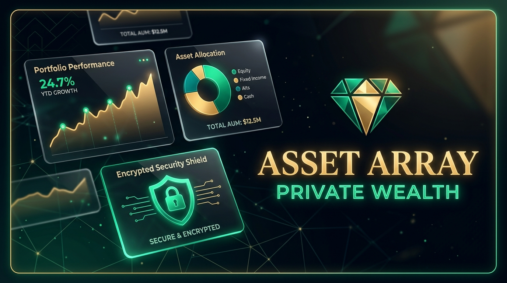

# Asset Array 💼📈

[](https://github.com/SakshamJ01/AssetArray)
[](https://asset-array.web.app)
[](https://assetarray.onrender.com/api/health)
[](https://cloud.mongodb.com)

[](https://github.com/SakshamJ01/AssetArray/actions)
[](https://www.revenuecat.com/)
[](https://expo.dev/)
[](https://ai.google.dev/)
[](https://github.com/SakshamJ01/AssetArray)



**AssetArray** is an advisor operating system for portfolio analytics, risk intelligence, tax estimation, client workflow, governance, and AI-assisted decision support.

Engineered with a high-contrast obsidian & champagne gold luxury aesthetic, dual-mode Swiss Private Banking light theme, real-time stochastic share market streaming engine, client-side zero-knowledge AES-256 encryption, multi-user cloud synchronization, responsive cross-platform web/desktop support, and built-in subscription monetization powered by **RevenueCat**.

> **Important Positioning & Regulatory Disclosure**:  
> AssetArray uses performance methodologies informed by GIPS® concepts but is not itself claiming GIPS compliance, certification, or verification. AssetArray provides advisor governance, decision-support, privacy, and analytical tooling; regulatory status, fiduciary responsibility, suitability determination, and compliance adherence remain the sole responsibility of the advisor or registered firm.

---

## 🌐 Live Production Deployments

| Tier | Provider | Live URL | Health / Status |
| :--- | :--- | :--- | :--- |
| **Frontend Web App** | Firebase Hosting (Global CDN) | [asset-array.web.app](https://asset-array.web.app) | 🟢 Live Production SPA |
| **Backend API** | Render (Node.js Express) | [assetarray.onrender.com](https://assetarray.onrender.com) | 🟢 [Health Status Check](https://assetarray.onrender.com/api/health) |
| **Cloud Database** | MongoDB Atlas (Cloud Replica) | AWS Cloud Cluster | 🟢 Encrypted Storage Active |

---

## 🌟 Version 3.3.1 Advisor Command Center & Governance Hardening

Comprehensive institutional methodology, mathematical formulas, claims policy, and statutory compliance documentation are available in the [`docs/`](docs/) directory:
- [Claims & Terminology Policy](docs/claims-policy.md)
- [Product Terminology Glossary](docs/terminology.md)
- [V3.4 Strategic Roadmap (Planned)](docs/v3-4-roadmap.md)
- [Advisor Command Center Architecture](docs/advisor-command-center.md)
- [Advisor Workflow & Prioritization Engine](docs/advisor-workflow.md)
- [Client 360 Workspace](docs/client-360.md)
- [Advisor Decision Journal & Governance Record](docs/decision-journal.md)
- [Daily AI Advisor Brief & Grounding Methodology](docs/ai-advisor-brief.md)
- [System Architecture](docs/architecture.md)
- [Analytics & Performance Methodology (GIPS-Informed TWR, XIRR, Brinson Attribution)](docs/analytics-methodology.md)
- [Statutory Indian Tax Methodology (AY 2026-27 & Sec 70/74)](docs/tax-methodology.md)
- [Risk & Benchmark Analytics (MPT, HWM Drawdowns, Mulberry32 Monte Carlo)](docs/risk-methodology.md)
- [AI Architecture & DPDP Act PII Sanitization](docs/ai-architecture.md)
- [Zero-Knowledge Security Model](docs/security.md)
- [Compliance & Statutory Disclosures](docs/compliance-disclosures.md)
- [v3.3.0 Release Notes](docs/release-notes-v3.3.md)
- [v3.2.0 Red-Team Hardening](docs/redteam-audit-report.md)
- [v3.1.0 Release Notes](docs/release-notes-v3.1.md)

### 🏛️ Brinson-Fachler Performance Attribution Engine
- **Alpha Decomposition:** Mathematically breaks down active portfolio returns against benchmark indices (NIFTY 50, CRISIL Hybrid 65:35, S&P 500) into **Allocation Effect**, **Selection Effect**, and **Interaction Effect**.
- **Plain-Language Explainability:** Plain-language synthesis explaining top alpha drivers and drag factors.

### 🛡️ AI Portfolio Health Score Diagnostic (0–100 Multi-Pillar Index)
- **5 Core Pillars:** Data Completeness, Asset Diversification (HHI-based entropy), Single-Asset Concentration Defense, Geographic & Currency Spread, and Liquidity & Debt Management.
- **Institutional Ratings:** Categorizes portfolios into *Institutional*, *Balanced*, *Moderate Risk*, and *High Fragility* with prioritized action steps.

### ⚖️ Indian Tax Intelligence & Loss Harvesting (Finance Act 2024 / FY 2025-26)
- **Updated Capital Gains Thresholds:** Section 112A LTCG at 12.5% above ₹1,25,000 exemption limit; Section 111A STCG at 20.0%.
- **1-Click Tax Harvest Action Plan:** Identifies loss positions, computes estimated immediate tax impact, and provides 30-day wash-sale protection guidance.

### 🎯 What-If Macro Scenario Sandbox & Stress Testing
- **Crisis Shock Templates:** Simulates historical shocks (2008 GFC Crunch, Tech Correction, 1970s Stagflation, Emerging Markets Liquidity Boom).
- **Outcome Distribution:** Computes P5 (worst-case tail risk), P50 (median NAV), and P95 (resilience NAV) with post-shock Sharpe ratio shifts.

### 📜 DPDP-Aligned AI Investment Committee Memorandum Studio
- **Zero-Knowledge PII Tokenization:** Replaces client identifiers with deterministic tokens (e.g. `Client Ref #AA-881`) ensuring alignment with India's DPDP Act 2023 data minimization principles.
- **Structured Executive Report:** One-click generation of formal Investment Committee memos with executive summary, risk diagnostics, attribution analysis, and advisor action plans.

### 🚨 Smart Alerts & Policy Violation Governance
- **Real-Time Guardrails:** Monitors concentration breaches (>20% single position), large drawdowns, health score drops, and tax-loss harvesting windows.

---

## ⚡ Core Platform Capabilities

### ⚡ Real-Time Share Market Streaming Engine & Level-2 Terminal
- **Authentic Multi-Asset Universe:** Streams live micro-ticks for **NSE/BSE Equities** (`RELIANCE`, `TCS`, `HDFCBANK`, `INFY`, `ICICIBANK`), **Global Indices** (`NIFTY 50`, `SENSEX`, `S&P 500`, `NASDAQ`), **Commodities** (`GOLD`), **Forex** (`USD/INR`), and **Crypto** (`BTC/USD`, `ETH/USD`).
- **Exchange Precision Ticking:** Realistic Brownian stochastic movement matching exchange tick sizes (₹0.05 on NSE, $0.01 on USD).
- **Interactive Level-2 Depth Terminal:** Top 5 Bids & Asks orderbook with real-time quantities, order counts, buy/sell volume pressure gauge, intraday 30-tick SVG sparkline, day high/low slider, and simulated trade desk.
- **Micro-Flash Live Ticker:** Animated green/red micro-glow chips flashing on price ticks with 1-tap deep inspection.
- **Continuous Portfolio Valuation Sync:** Client holdings (`currentValue = quote.price * quantity`) dynamically update in real time as market securities tick.

### 🎲 Monte Carlo Wealth Simulator
- **1,000 Path Stochastic Forecast:** Simulates portfolio growth under historical market volatility and drift to compute statistical goal success probabilities.
- **Confidence Bands:** 10th (pessimistic), 50th (median), and 90th (optimistic) percentile trajectory paths.

### 📄 1-Click Statement & CSV Importer
- **Automated Ingestion:** Instant parsing of brokerage CSV and text statements.
- **Smart Asset Classification:** Automatically categorizes parsed securities into Equities, Mutual Funds, Fixed Income, and Commodities.

### 🤖 Conversational AI Wealth Copilot (Google Gemini)
- **Context-Aware Portfolio Assistant:** Instant chat answering complex queries regarding asset exposure, rebalancing requirements, and risk distribution.
- **One-Touch Prompts:** Pre-configured analysis shortcuts ("Analyze concentration risk", "Generate tax harvesting plan").

### 🗺️ Dynamic Holdings Treemap / Heatmap
- **Visual Allocation Studio:** Interactive area-proportional tiles showcasing portfolio weightings and returns.

### 🛡️ Client Investor Shareable Portal
- **Branded Read-Only Dossier:** Generate secure, client-facing portfolio dashboards for high-net-worth clients.

### 💎 Pro Advisor Monetization (RevenueCat)
- **Native In-App Purchases:** Integrated via `react-native-purchases` supporting iOS App Store, Google Play, and RevenueCat Test Store sandbox.
- **Conversion-Optimized Paywall:** High-converting modal UI highlighting Pro benefits (Monthly & Annual pricing tiers).
- **Feature Gating:** Free tier vs. Pro tier access control gating AI Portfolio Co-Pilot and Unlimited Client PDF Exports.
- **In-App Subscription Management:** Real-time plan status indicator, purchase restore, and a built-in sandbox reset toggle in Settings.

### 📄 Executive PDF Report Studio
- **Print & Share Ready:** Generates high-resolution, branded PDF portfolio summary reports on-device using `expo-print` and `expo-sharing`.
- **Advisor Branding:** Automatically stamps advisor credentials, disclaimers, asset breakdowns, and contact information.

### 📊 Comprehensive Financial Calculators
- **Stateless Calculation Engine:** Pure mathematical models for SIP, Cash Flow (payout & cumulative), Retirement, and Goal Planning (`src/services/calculators.ts`).
- **Interactive Projections:** Instant visual feedback on returns, inflation impact, and target maturity dates.

### 🔒 Enterprise Security & End-to-End Cloud Sync
- **Hardware PIN & Biometrics:** Local authentication with Face ID / Touch ID via `expo-local-authentication` and `expo-secure-store`.
- **Zero-Knowledge Encryption:** End-to-end AES-256 client encrypted synchronization with MongoDB Atlas.
- **Role-Based Cloud Auth:** Token-based JWT access and refresh rotation (`/api/auth/login`, `/api/auth/refresh`).

---

## 🏗️ Architecture & Platform Stack

```
AssetArray/
├── App.tsx                              # Root layout, live ticker sync, navigation orchestration
├── firebase.json                        # Firebase Hosting configuration with SPA rewrites
├── render.yaml                          # Render.com Web Service Blueprint CI/CD
├── src/
│   ├── components/
│   │   ├── DesktopSidebar.tsx           # Executive desktop navigation sidebar & shortcuts
│   │   ├── DashboardScreen.tsx          # Executive dashboard metrics, charts, and quick actions
│   │   ├── LiveMarketTicker.tsx         # Real-time ticking header with micro-flash animations
│   │   ├── AiWealthCopilot.tsx          # Floating conversational AI copilot
│   │   ├── BottomTabBar.tsx             # Mobile bottom navigation bar
│   │   ├── charts/
│   │   │   ├── HoldingsTreemap.tsx      # Interactive portfolio allocation treemap
│   │   │   ├── PerformanceChart.tsx     # Historical portfolio trajectory chart
│   │   │   └── Sparkline.tsx            # SVG micro-trend lines
│   │   └── modals/
│   │       ├── LiveMarketDepthModal.tsx # Level 2 Orderbook Depth Terminal
│   │       ├── MonteCarloModal.tsx      # 1,000-run statistical simulation studio
│   │       ├── StatementImportModal.tsx # 1-Click CSV/Statement parser
│   │       ├── ClientPortalModal.tsx    # Shareable client investor portal
│   │       ├── RebalanceModal.tsx       # Institutional portfolio rebalancing
│   │       └── StressTestModal.tsx      # 2008 Crash, Tech Bubble & Rate Hike stress testing
│   ├── screens/
│   │   ├── ClientsScreen.tsx            # Search, filter, client dossier & report studio
│   │   ├── PortfoliosScreen.tsx         # Unified portfolio analytics & live market feed
│   │   ├── ToolsScreen.tsx              # SIP, Cash Flow, Retirement, Goal Center & Vault
│   │   ├── WorkspaceScreen.tsx          # AI research brief, market message & aggregations
│   │   ├── SettingsScreen.tsx           # Security, theme, cloud sync, and subscriptions
│   │   └── PaywallScreen.tsx            # RevenueCat Pro Advisor Paywall UI
│   ├── services/
│   │   ├── realTimeMarket.ts            # Stochastic Brownian market tick & depth engine
│   │   ├── monteCarlo.ts                # Statistical path generation engine
│   │   ├── statementParser.ts           # CSV/statement parsing & classification
│   │   ├── revenueCat.ts                # RevenueCat SDK initialization & entitlements
│   │   ├── secureSync.ts                # AES-256 cryptographic sync client
│   │   ├── pdfReport.ts                 # Executive PDF report generation
│   │   ├── calculators.ts               # Pure financial models (SIP, Cash Flow, Goals)
│   │   └── aiAdvisor.ts                 # Gemini AI portfolio analyzer
│   └── theme/
│       └── colors.ts                    # Obsidian & Champagne Gold + Swiss Luxury Light palettes
├── backend/                             # Node.js + Express + MongoDB Atlas cloud API
│   ├── server.js                        # REST API (Auth, E2EE Sync, AI Research, Audit Logs)
│   ├── Dockerfile                       # Multi-stage production container
│   └── package.json                     # Backend dependencies
└── __tests__/                           # 41 passing Jest unit tests across 9 suites
```

---

## 🚀 Getting Started

### 1. Run the Mobile & Web App Locally
```bash
# Clone repository
git clone https://github.com/SakshamJ01/AssetArray.git
cd AssetArray

# Install dependencies
npm install

# Start local web development server
npm run web

# Or start universal Expo bundler (iOS / Android / Web)
npm start
```

### 2. Build and Deploy Web App to Firebase Hosting
```bash
# Production deployment
npm run deploy:web

# Or deploy to an ephemeral preview channel
npm run deploy:preview
```

### 3. Run Automated Tests
```bash
npm test
```

### 4. Deploy Backend API
The backend is configured for continuous deployment on [Render.com](https://render.com) using the included `render.yaml` blueprint. Simply connect the repository to Render, configure your environment variables (`MONGO_URI`, `GEMINI_API_KEY`, etc.), and deployment runs automatically on push to `main`.

---

## 💳 RevenueCat Monetization Setup

The app is pre-configured with RevenueCat's Test Store key for instant sandbox testing:
- **Test Key:** Pre-configured in `src/services/revenueCat.ts`.
- **Entitlement ID:** `pro_advisor`.
- **Testing Flow:** Open the app ➔ Go to **Clients** ➔ Tap **Export PDF Report** ➔ Experience the **Paywall** ➔ Tap **Subscribe** to unlock Pro features.
- **Sandbox Reset:** Navigate to **Settings** ➔ **Subscription (RevenueCat)** ➔ **Reset to Free Plan**.

---

## 🏆 Shipathon 2026 Submission

Asset Array is submitted for **Shipathon 2026 (Student Track)**:
- **Track:** Student Track
- **Monetization Engine:** RevenueCat (`react-native-purchases`)
- **Offerings:** Pro Advisor Monthly & Annual Subscriptions
- **Core Innovation:** Real-time share market streaming engine, Level-2 depth terminal, Monte Carlo wealth simulation, enterprise zero-knowledge client encryption, and Gemini-powered wealth co-pilot.

---

## 📄 License
This project is open source and available under the [MIT License](LICENSE).
