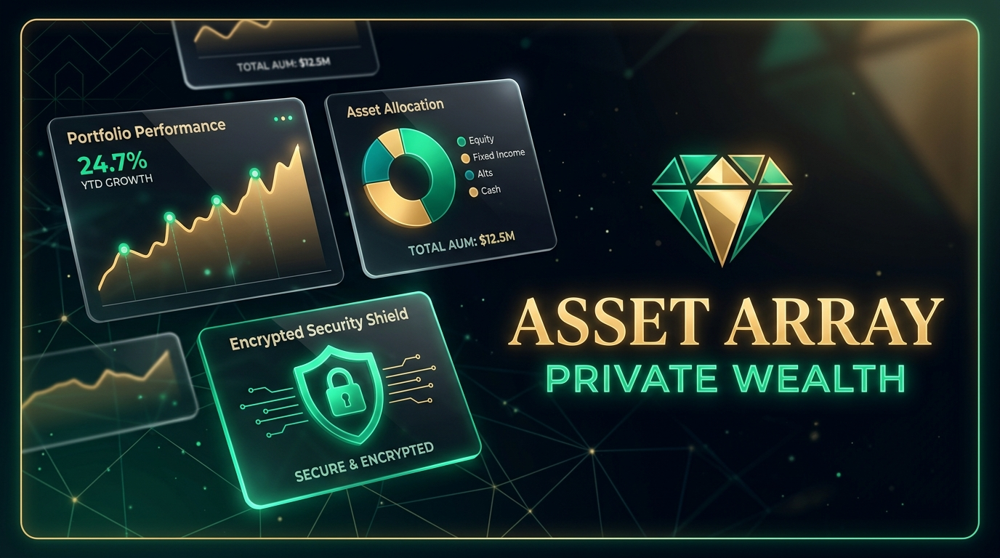

# Asset Array 💼📈

[](https://github.com/SakshamJ01/AssetArray)
[](https://asset-array.web.app)
[](https://assetarray.onrender.com/api/health)
[](https://cloud.mongodb.com)

[](https://github.com/SakshamJ01/AssetArray/actions)
[](https://www.revenuecat.com/)
[](https://expo.dev/)
[](https://ai.google.dev/)
[-22c55e.svg)](https://github.com/SakshamJ01/AssetArray)



**AssetArray** is an institutional-grade wealth management & advisor operating system engineered for wealth managers, RIAs, family offices, and financial advisors. It unifies portfolio analytics, risk intelligence, tax estimation, client 360 dossiers, AI decision support, zero-PII statement parsing, and governance into a seamless cross-platform solution.

Engineered with a high-contrast **Obsidian & Champagne Gold** luxury aesthetic (`#030712` / `#E0A84C`), dual-mode **Swiss Private Banking** light theme, real-time stochastic share market streaming engine, client-side zero-knowledge AES-256 encryption, multi-user cloud synchronization, responsive web/desktop/mobile UX, and built-in subscription monetization powered by **RevenueCat**.

> **Important Positioning & Regulatory Disclosure**:  
> AssetArray uses performance methodologies informed by GIPS® concepts but is not itself claiming GIPS compliance, certification, or verification. AssetArray provides advisor governance, decision-support, privacy, and analytical tooling; regulatory status, fiduciary responsibility, suitability determination, and compliance adherence remain the sole responsibility of the advisor or registered firm.

---

## 🌐 Live Production Deployments

| Tier | Provider | Live URL | Health / Status |
| :--- | :--- | :--- | :--- |
| **Frontend Web App** | Firebase Hosting (Global CDN) | [asset-array.web.app](https://asset-array.web.app) | 🟢 Live Production SPA |
| **Backend API** | Render (Node.js Express) | [assetarray.onrender.com](https://assetarray.onrender.com) | 🟢 [Health Status Check](https://assetarray.onrender.com/api/health) |
| **Cloud Database** | MongoDB Atlas (Cloud Replica) | AWS Cloud Cluster | 🟢 Encrypted Storage Active |
| **PDF Documentation** | Workspace PDF Artifact | `AssetArray_Full_Project_Documentation.pdf` | 🟢 PDF Generated |

---

## 🏛️ Enterprise Architecture Blueprint (5-Tier Tier-1 Stack)

```
┌─────────────────────────────────────────────────────────────────────────────────────────┐
│                          LAYER 1: UNIVERSAL PRESENTATION & UX                           │
│  Universal Web (Next.js/Expo Web)  •  Native Mobile (iOS/Android)  •  Desktop Cmd Sidebar│
└──────────────────────────────────────────┬──────────────────────────────────────────────┘
                                           │
┌──────────────────────────────────────────▼──────────────────────────────────────────────┐
│                      LAYER 2: FEATURE CONTROLLERS & REACTIVE STATE                      │
│  Domain Custom Hooks (usePortfolio, useMarketData)  •  Biometric & Hardware PIN Lock    │
└──────────────────────────────────────────┬──────────────────────────────────────────────┘
                                           │
┌──────────────────────────────────────────▼──────────────────────────────────────────────┐
│                LAYER 3: CORE DOMAIN & MATHEMATICAL ANALYTICS ENGINE                     │
│  • GIPS TWR & Newton-Raphson XIRR Engine (<1e-7 tolerance)                              │
│  • Modern Portfolio Theory (Sharpe, Sortino, Parametric/Historical VaR, Max Drawdown)  │
│  • Brinson-Fachler Multi-Factor Attribution (Allocation, Selection, Interaction Alpha)  │
│  • 1,000-Path Monte Carlo Geometric Brownian Simulation                                 │
│  • FY 2025-26 Indian Statutory Tax Engine (12.5% LTCG / 20.0% STCG)                     │
│  • Multi-Asset Rebalance Drift & Tax-Optimal Execution Router                           │
└──────────────────────────────────────────┬──────────────────────────────────────────────┘
                                           │
┌──────────────────────────────────────────▼──────────────────────────────────────────────┐
│              LAYER 4: INGESTION, STREAMING & INSTITUTIONAL GATEWAYS                     │
│  • Broker Gateway (FIX 4.4 Protocol, Zerodha Kite, Upstox API v2, ICICI Direct Breeze)   │
│  • Account Aggregator Framework (RBI Sahamati Consent Management & FIP Data Extraction)  │
│  • Zero-PII Multi-Broker Statement Parser (CAMS, KFintech, Zerodha, Upstox, ICICI)      │
│  • Real-Time Market Bus (Official AMFI NAV Feeds, Finnhub Global Quotes, L2 Depth)     │
│  • Firm-Wide Batch Review & Dossier Generator (Automated Review Package for 100+ Clients)│
└──────────────────────────────────────────┬──────────────────────────────────────────────┘
                                           │
┌──────────────────────────────────────────▼──────────────────────────────────────────────┐
│               LAYER 5: SECURITY, STORAGE & COMPLIANCE INFRASTRUCTURE                    │
│  • Zero-Knowledge Local Storage (PBKDF2 100k + AES-256-GCM Cryptographic Storage)       │
│  • DPDP Act 2023 Redaction Pipeline (PAN, Aadhaar, Bank, Folio, Demat Sanitization)     │
│  • Tamper-Proof Audit Logging & SHA-256 Receipt Fingerprints (AA-SIG-...)               │
│  • Offline-First Sync Adapter & Cloud Vault Replication (MongoDB Atlas / Render API)   │
└─────────────────────────────────────────────────────────────────────────────────────────┘
```

---

## 📖 Complete Exhaustive Feature & Functionality Directory

Below is the deep, exhaustive breakdown of **every single feature, tool, workflow, and micro-functionality** built into AssetArray:

---

### 1. 🔑 Authentication, Security & Access Control
* **Manual Cloud Backend Sign-In**: Username and password login against the Render backend (`/api/auth/login`) returning JWT access and refresh token pairs.
* **Auto-Fill Cloud Backend URL**: One-tap URL population shortcut (`https://assetarray.onrender.com`) for production cloud environment connection.
* **JWT Access & Refresh Token Lifecycle**: Automatic silent token renewal (`/api/auth/refresh`) on `401 Unauthorized` responses via `refreshAccessTokenIfNeeded()`.
* **Logout & Session Revocation**: Securely invalidates refresh tokens on the server (`/api/auth/logout`) and purges local session tokens from device storage.
* **Hardware PIN Setup & Lock Screen**: 4-digit PIN setup persisted via `expo-secure-store` with auto-lock screen verification.
* **Biometric Authentication**: Hardware unlock via Apple Face ID / Touch ID or Android Biometrics using `expo-local-authentication`.
* **Haptics & Tactile Feedback**: Customizable selection and notification haptics using `expo-haptics` with user preference persistence.
* **Dual Luxury Theme Engine**: High-contrast Obsidian & Champagne Gold dark theme (`#030712`) and Swiss Private Banking light theme.
* **Client-Side Zero-Knowledge Encryption**: End-to-end AES-256 client payload encryption before cloud transmission using PIN-derived cryptographic keys.
* **Backend Environment Security Hardening**: Strict production rules requiring non-default `TOKEN_SECRET`, `REFRESH_SECRET`, and domain-restricted `CORS_ORIGIN`.
* **1-Click Storage Hygiene Reset (`Clear All Local Data`)**: Comprehensive device data wiper in Settings that purges client rosters, portfolios, notes, auth tokens, biometric/PIN locks, and telemetry caches, returning the desk to the clean onboarding vault lock.

---

### 2. 👤 Client 360 Workspace & Roster Management
* **Comprehensive Client Roster**: Filterable cards and tables displaying client name, category, risk profile, priority, city, allocation, and reminder dates.
* **Multi-Attribute Search & Filter**: Real-time search across client names, emails, phone numbers, cities, and risk profiles.
* **Category Filters**: Instant segmentation by category (*All*, *HNI*, *Ultra HNI*, *Retail*, *Institutional*).
* **Mode Filters**: Quick filtering by *All Clients*, *Due Reminders*, and *High Priority*.
* **1-Click Client Roster CSV Export (`Export (.csv)`)**: Direct CSV export of all filtered client profiles, risk ratings, contact schedules, and portfolio values available in both the Client Roster toolbar and Desktop Sidebar (`Export Roster (.csv)`).
* **Honest Empty State Protection**: Guarded roster export alerting the advisor honestly when zero clients are loaded, with zero mock or ghost client generation.
* **Client Onboarding & Creation Modal**: Comprehensive draft editor capturing Name, Phone, Email, Category, Risk Profile, Preferred Channel (Email/WhatsApp/SMS), Watchlist Tickers, City, Target Asset Allocation, Contact Reminder Date, Priority Level, and Notes.
* **Client Dossier Editor**: Edit existing client records and instantly persist updates across local storage and cloud state.
* **Client Deletion**: Safe deletion workflow with confirmation prompt to prevent accidental data loss.
* **Bulk Client Selection**: Multi-select checkbox matrix for batch operations and campaign outreach.
* **Contact Reminder Engine**: Automatic detection and visual highlighting of overdue or scheduled client touchpoints.
* **Client Contact & Interaction Log**: Historical interaction log recording date and summary notes per client.

---

### 3. 📄 1-Click Statement & CAS Importer Engine (Zero-PII)
* **Multi-Broker Statement Support**: Automated parsing engine with auto-detection for **Zerodha**, **Upstox**, **ICICI Direct**, **Groww**, **CAMS**, and **NDSL eCAS** consolidated account statements (`src/services/statementParser.ts`).
* **Deepened Zero-PII Redaction Layer**: Integrated `sanitizePii()` function scrubbing PAN numbers, Aadhaar IDs, email addresses, phone numbers, Demat/BO IDs (`[REDACTED_DEMAT_ID]`), bank accounts (`[REDACTED_BANK_ACCOUNT]`), IFSC codes (`[REDACTED_IFSC]`), and folio numbers (`[REDACTED_FOLIO]`) in accordance with India's DPDP Act 2023.
* **1-Click Quick Broker Preset Chips**: Embedded quick sample chips (`⚡ Zerodha`, `⚡ Upstox`, `⚡ ICICI Direct`, `⚡ CAMS CAS`, `⚡ Groww`) directly in the modal for instant sample ingestion, validation, and testing.
* **Prominent Button Placement**: Accessible via Desktop Sidebar, Client Roster Header, and Portfolios Workstation Bar.
* **Smart Asset Categorization**: Automatically maps parsed securities into Equities, Mutual Funds, Fixed Income, Commodities, and Cash with gain/loss metrics and allocations.

---

### 4. ⚡ Institutional Broker Gateway & Order Routing Engine
* **Universal Broker Gateway (`src/services/brokerConnect/`)**: Unified routing engine translating rebalance drift and advisory recommendations into validated broker-specific order payloads.
* **Supported Protocols & Connectors**:
  * **Zerodha Kite Connect**: Formats regular, AMO, and Stop-Loss orders with exchange routing (`NSE`/`BSE`).
  * **Upstox API v2**: Generates multi-order batches with validation against order slice limits.
  * **ICICI Direct Breeze API**: Routes equity cash and derivatives transactions.
  * **Institutional FIX 4.4 Protocol**: Compiles compliant `NewOrderSingle (MsgType=D)` messages with tags 11 (ClOrdID), 55 (Symbol), 54 (Side), 38 (OrderQty), 40 (OrdType), and 44 (Price).
* **Cryptographic Execution Receipts**: Produces immutable SHA-256 receipt signatures (`AA-SIG-...`) for regulatory auditability.

---

### 5. 🏦 Account Aggregator (AA) Open Banking Framework
* **RBI / Sahamati Standard Consent Lifecycle (`src/services/accountAggregator/`)**:
  * Consent request creation with fine-grained date ranges, data frequency, and account types (Deposit, Mutual Funds, Equities).
  * 6-digit multi-factor mobile OTP validation state machine (`validateOtp()`).
  * FIP (Financial Information Provider) encrypted data unmarshaling.
* **Automated Asset Hydration**: Automatically maps verified bank account balances and depository folios into the client's asset inventory.

---

### 6. 📁 Firm-Wide Batch Reporting & Multi-Client Review Engine
* **Firm-Wide Review Generator (`src/services/batchReporting.ts`)**: Iterates across an entire advisor desk roster (100+ clients) and evaluates:
  * Aggregated Firm AUM & Asset Class breakdown.
  * GIPS Rebalance Drift Detection (flags clients with drift > 5.0%).
  * 0–100 Portfolio Health Diagnostic scores.
  * 30-Day and YTD Brinson-Fachler active alpha attribution.
* **Multi-Format Export**: Generates compliance-ready CSV summaries and Markdown dossiers for investment committee meetings.

---

### 7. 📊 Portfolio Analytics, Valuation & Performance Engine
* **Multi-Asset Class Support**: Tracks positions across 8 asset classes: Equities, Mutual Funds, Fixed Income, Commodities, Cash & Equivalents, Crypto, Real Estate, and International Assets.
* **Holding Creation & Editing**: Add/edit position details including Asset Name, Asset Class, Ticker, Quantity, Invested Value, Current Market Value, Target Weight %, and Notes.
* **Real-Time Live Valuation Sync**: Client portfolio market values dynamically update live as market securities tick.
* **Time-Weighted Return (TWR) Engine**: GIPS-informed sub-period return calculation isolating external cash flows (`src/services/performance/twr.ts`).
* **Money-Weighted Return (XIRR) Engine**: Exact Newton-Raphson cash-flow yield calculation (`src/services/performance/xirr.ts`).
* **Visual Holdings Treemap / Heatmap**: Interactive area-proportional rectangular tiles displaying asset weights and return performance.
* **Portfolio Rebalancing Studio**: Automated rebalance engine calculating current vs. target weight drift and generating exact Buy/Sell order lists (`src/services/rebalancer.ts`).

---

### 8. 📈 Real-Time Live Share Market Ticker & Level-2 Terminal
* **Live Micro-Flash Header Ticker**: Top bar streaming ticks for **Equities & Indices** (`RELIANCE`, `TCS`, `INFY`, `ITC`, `NVDA`, `BANKNIFTY`, `NIFTY 50`, `SENSEX`), **Commodities & Bonds** (`SILVER`, `SGB_GOLD`, `BHARATBOND30`, `IN_10Y_GSEC`), **FX** (`USD/INR`), and **Crypto** (`BTC/USD`, `ETH/USD`).
* **Quant Indicators & Calculations**: Built-in quant helpers including Wilder-smoothed **Relative Strength Index** (`calculateRSI`, period 14) and top-of-book **Bid-Ask Spread in Basis Points** (`calculateSpreadBps`).
* **Stochastic Brownian Ticking Engine**: Realistic exchange micro-movement with green/red micro-glow animations matching exchange tick sizes.
* **Level-2 Depth Terminal (`LiveMarketDepthModal`)**: Top 5 Bid & Ask order book depth with live quantities, buy/sell volume pressure gauge, intraday 30-tick SVG sparklines, day high/low range slider, and simulated trade execution.
* **Official AMFI NAV Integration (`AmfiNavProvider`)**: Ingests official Indian Mutual Fund Net Asset Values from AMFI India endpoints.
* **Live Finnhub Market Data (`FinnhubProvider`)**: Real US/global equity quotes and FX via the Finnhub API.

---

### 9. 🛡️ Institutional Risk Intelligence & Portfolio Health Score
* **0–100 Portfolio Health Score Diagnostic (`calculateHealthScore`)**: Multi-pillar rating evaluating Data Completeness, Asset Diversification (HHI Entropy), Single-Asset Concentration Defense, Geographic & Currency Spread, and Liquidity & Debt Management.
* **Modern Portfolio Theory (MPT) Risk Metrics**: Computes Portfolio Volatility (Standard Deviation), Sharpe Ratio, Beta against Benchmark, Max Drawdown, and High Watermark.
* **Multi-Benchmark Comparison**: Benchmarks client performance against NIFTY 50, CRISIL Hybrid 65:35, and S&P 500.

---

### 10. 🏛️ Brinson-Fachler Performance Attribution Engine
* **Alpha Decomposition**: Mathematically breaks active portfolio outperformance/underperformance into **Allocation Effect**, **Selection Effect**, and **Interaction Effect**.
* **Plain-Language Explainability**: Auto-generates narrative summaries detailing top alpha drivers and drag positions.

---

### 11. ⚖️ Indian Tax Intelligence & Loss Harvesting (AY 2026-27 / FY 2025-26)
* **Section 112A LTCG Tax Engine**: 12.5% tax rate calculation on long-term equity gains above the ₹1,25,000 statutory exemption limit.
* **Section 111A STCG Tax Engine**: 20.0% tax rate calculation on short-term equity gains.
* **Section 70 & 74 Set-off & Carry-Forward Engine**: Enforces statutory intra-head and inter-head gain/loss offset rules.
* **Tax Lot FIFO/LIFO Evaluation**: Evaluates individual buy/sell tax lots for term classification.
* **1-Click Tax Loss Harvesting Plan**: Identifies loss positions, computes immediate tax savings, and provides 30-day wash-sale protection guidance.

---

### 12. 🎯 What-If Macro Scenario Sandbox & Stress Testing
* **Historical Crisis Presets (`PRESET_SCENARIOS`)**: Simulates shocks including *2008 GFC Crunch*, *Tech Correction*, *1970s Stagflation*, and *Emerging Markets Liquidity Boom*.
* **Custom Shock Sliders**: Allows advisors to tweak equity market drops, interest rate shifts, and FX movements.
* **Outcome Distribution & Tail Risk**: Computes P5 (worst-case tail risk), P50 (median NAV), P95 (resilience NAV), and post-shock Sharpe ratio shifts.

---

### 13. 🎲 1,000-Path Monte Carlo Wealth Simulator
* **Mulberry32 PRNG Generator**: Reproducible, seedable 1,000-run stochastic path simulation (`src/services/monteCarlo.ts`).
* **Statistical Probability of Success**: Computes exact percentage probability of achieving target wealth goals.
* **Percentile Trajectories**: Displays 10th (pessimistic), 50th (median), and 90th (optimistic) percentile visual curves.

---

### 14. 🤖 Conversational AI Wealth Copilot & AI Advisor Brief
* **Multi-Provider AI Gateway (`AiRouter`)**: Routes AI prompts across Google Gemini (`gemini-2.5-flash`, `gemini-2.5-pro`), OpenAI, Anthropic, and local Ollama daemon (`qwen3:4b`, `llama3.2`).
* **Dynamic Ollama Provider**: Dynamic local model discovery (`getActiveModel()`) for zero-latency, local AI copilot execution.
* **Zero-Knowledge PII Sanitization**: Replaces client names and PII with deterministic tokens (e.g. `Client Ref #AA-881`) aligned with DPDP Act 2023.
* **AI Output Grounding (`validateClaimsAgainstContext`)**: Verifies numerical claims in AI responses against actual portfolio data.
* **Floating Conversational Copilot (`AiWealthCopilot`)**: Context-aware chat assistant answering portfolio queries, rebalancing questions, and risk breakdowns.

---

### 15. 📄 Executive PDF Report Studio & Client Shareable Portal
* **On-Device PDF Generation**: Generates high-resolution branded PDF portfolio summary reports using `expo-print` and `expo-sharing`.
* **Advisor Branding & Stamping**: Stamps advisor credentials, disclaimers, asset breakdowns, and contact information.
* **Shareable Client Portal (`ClientPortalModal`)**: Generates read-only investor dossier for client review.

---

### 16. 🧮 Comprehensive Financial Calculators Center
* **SIP Calculator**: Computes future wealth, total invested amount, and wealth gain for systematic investment plans.
* **Cash Flow Calculator**: Models cumulative and payout cash flows.
* **Retirement Calculator**: Estimates required retirement corpus based on inflation, current expenses, and post-retirement yield.
* **Financial Goal Center**: Computes required monthly savings to achieve target goal values.

---

### 17. 💳 Pro Advisor Monetization (RevenueCat)
* **Native In-App Purchases (`react-native-purchases`)**: Integrated RevenueCat SDK supporting iOS App Store, Google Play, and Web Test Store sandbox.
* **Pro Paywall Modal (`PaywallScreen`)**: Conversion-optimized paywall supporting Monthly and Annual subscription tiers.
* **Entitlement Gating (`pro_advisor`)**: Gates access to AI Portfolio Co-Pilot and Unlimited PDF Exports.

---

### 18. ☁️ Enterprise End-to-End Cloud Synchronization
* **E2EE Cloud Sync (`syncToCloud`, `restoreFromCloud`)**: Pushes/pulls AES-256 encrypted payloads to MongoDB Atlas via Render API.
* **Live Sync Status Badge (`SyncBadge`)**: Real-time header badge displaying `SYNCING`, `OFFLINE`, `ERROR`, or `SYNCED`.
* **Zero-Cache Firebase CDN Config**: `firebase.json` headers enforcing `no-cache, no-store, must-revalidate` on SPA routes to guarantee immediate bundle updates.

---

## 🏗️ Architecture & Platform Stack

```
AssetArray/
├── .agents/rules/                       # Codified engineering rules & agentic pair-programming guardrails
│   ├── expo-env-inlining.md             # Enforces direct EXPO_PUBLIC_* member access for Metro inlining
│   ├── honest-analytics.md              # Enforces INSUFFICIENT_DATA / zero fabricated return metrics
│   ├── e2e-storage-hygiene.md           # Mandates ephemeral browser context isolation & local storage reset
│   └── git-push.md                      # Mandatory push-to-main synchronization
├── App.tsx                              # Root layout, live ticker sync, navigation orchestration, auth & lock
├── firebase.json                        # Firebase Hosting configuration with SPA rewrites & zero-cache headers
├── render.yaml                          # Render.com Web Service Blueprint CI/CD
├── scripts/
│   ├── verify-v4-enhancements.js        # Native Chrome headless automation verifying 7 live stages & storage reset
│   ├── postbuild.js                     # Service worker cleanup, font preconnect & dark reset injector
│   ├── generate-pdf-docs.js             # Headless Chrome script generating full project PDF documentation
│   └── check-live.js                    # Live HTTP response & JS bundle status checker
├── src/
│   ├── components/
│   │   ├── DesktopSidebar.tsx           # Desktop navigation sidebar with Quick Import & Export Roster actions
│   │   ├── LiveMarketTicker.tsx         # Real-time ticking header with micro-flash animations
│   │   ├── AiWealthCopilot.tsx          # Floating conversational AI copilot (Gemini + Ollama)
│   │   └── modals/
│   │       ├── StatementImportModal.tsx # 1-Click Zero-PII CSV/Statement parser with Upstox/ICICI presets
│   │       ├── LiveMarketDepthModal.tsx # Level 2 Orderbook Depth Terminal with RSI & Spread Bps
│   │       ├── MonteCarloModal.tsx      # 1,000-run statistical simulation studio
│   │       └── RebalanceModal.tsx       # Institutional portfolio rebalancing
│   ├── screens/
│   │   ├── ClientsScreen.tsx            # Search, filter, client dossier, statement import & roster CSV export
│   │   ├── PortfoliosScreen.tsx         # Unified portfolio analytics & action bar statement import
│   │   └── PaywallScreen.tsx            # RevenueCat Pro Advisor Paywall UI
│   └── services/
│       ├── accountAggregator/           # RBI Sahamati consent generator, OTP validator & FIP data decryptor
│       ├── batchReporting.ts            # Firm-wide review package & GIPS drift dossier generator
│       ├── brokerConnect/               # Multi-broker order gateway (Zerodha, Upstox, Breeze, FIX 4.4)
│       ├── statementParser.ts           # Zero-PII Zerodha/Upstox/ICICI Direct/Groww/CAMS statement parser
│       ├── realTimeMarket.ts            # Ticker engine (ITC, NVDA, SILVER, BANKNIFTY) + RSI & Spread Bps
│       └── aiGateway/providers/         # Resilient multi-model gateway (Gemini, Anthropic, OpenAI, Ollama)
└── __tests__/                           # 88 passing Jest test suites (477 total unit/E2E tests)
```

---

## 📜 Codified Engineering Rules (.agents/rules/)

The repository enforces strict architectural contracts codified in `.agents/rules/`:

1. **Expo Env Static Inlining (`expo-env-inlining.md`)**:
   - `EXPO_PUBLIC_*` environment variables must always be accessed via **direct member access** (`process.env.EXPO_PUBLIC_VAR`).
   - Optional chaining (`process.env?.EXPO_PUBLIC_VAR`) is prohibited because Metro bundler performs string-literal static replacement at build time; optional chaining bypasses inlining and resolves to `undefined` in web bundles.
2. **Honest Empty Analytics (`honest-analytics.md`)**:
   - Portfolios with zero holdings or unallocated clients must emit `INSUFFICIENT_DATA` or `NO_HOLDINGS`.
   - Never synthesize fake returns, benchmark deltas, or ghost allocations.
3. **E2E Storage Hygiene (`e2e-storage-hygiene.md`)**:
   - Automated browser test runs must use fresh, ephemeral contexts (`browser.newContext({ storageState: undefined })`).
   - Automated tests must sweep and clear `localStorage` / `sessionStorage` to prevent test-pollution of local advisor vaults.

---

## 🚀 Getting Started

### 1. Run local development app
```bash
git clone https://github.com/SakshamJ01/AssetArray.git
cd AssetArray
npm install
npm run web
```

### 2. Run Automated Test Verification & Live Browser QA
```bash
# Run full 88-suite Jest test regression (477 tests passing)
npm test

# Run live headless Chrome browser verification (7 stages + storage reset)
node scripts/verify-v4-enhancements.js

# Run the canonical 7-gate verification (tsc, backend syntax, tests,
# AI audit, desktop E2E, mobile audit, production build)
npm run verify:all

# TypeScript typecheck
npm run typecheck
```

---

## 📄 License
This project is open source and available under the [MIT License](LICENSE).

