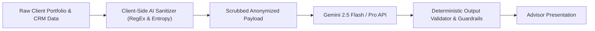

# AssetArray v3.1 AI Architecture & DPDP Safety Framework

## 1. Zero-PII Privacy Architecture (DPDP Act 2023 Compliance)

To comply with India's **Digital Personal Data Protection Act, 2023 (DPDP Act)** and international privacy standards, AssetArray enforces client-side PII sanitization before any prompt or context is passed to external Large Language Models (Gemini 2.5).



### 1.1 Redaction Vectors
Located at `src/services/ai/aiSanitizer.ts`:
- **Permanent Account Number (PAN)**: `[A-Z]{5}[0-9]{4}[A-Z]{1}` $\to$ `[REDACTED_PAN_xxxx]`
- **Aadhaar Number**: 12-digit UIDAI sequences $\to$ `[REDACTED_AADHAAR]`
- **Bank Account / Demat Account Numbers**: 9-18 digit strings $\to$ `[REDACTED_ACCOUNT_xxxx]`
- **Email Addresses**: RFC 5322 patterns $\to$ `[REDACTED_EMAIL]`
- **Phone Numbers**: Indian mobile prefixes (+91 / 10-digits) $\to$ `[REDACTED_PHONE]`
- **Client Full Names**: Replaced with pseudonymized token (e.g. `Client-ALPHA-812`)

---

## 2. Institutional Committee Memorandum Engine

Located at `src/services/committeeMemo.ts`:

Produces a formal 14-section Investment Committee Memorandum grounded strictly in computed mathematical artifacts:

1. **Executive Mandate & Account Summary**
2. **Current Portfolio Valuation & Cost Basis**
3. **Data Quality & Provenance Audit**
4. **Performance Attribution Breakdown (Brinson-Fachler)**
5. **Benchmark Risk Profiling (Alpha, Beta, Sharpe, Sortino)**
6. **Maximum Drawdown & High-Water Mark Diagnostics**
7. **Seven-Factor Portfolio Health Index**
8. **Statutory Capital Gains & Tax-Loss Harvesting Review (AY 2026-27)**
9. **Stress Testing & Macro Shock Simulation**
10. **Monte Carlo Probabilistic Goal Feasibility (P5 to P95)**
11. **Consolidated Net Worth & Liability Structure**
12. **Tactical Asset Allocation & Rebalancing Recommendations**
13. **Active Smart Alerts & Governance Notices**
14. **Fiduciary Disclosures & Statutory Citations**

### 2.1 Verifiable Source Citations
Every numerical statement in the memo is bound to an audit proof citation:
- `engine:health-v1.2`
- `engine:brinson-fachler-v1.1`
- `engine:in-tax-ay2026-27`
- `engine:monte-carlo-mulberry32`

---

## 3. Output Validation & Anti-Hallucination Guardrails

Located at `src/services/ai/aiSafety.ts`:
- **Markdown Fence Stripping**: Extracts raw JSON payloads from responses wrapped in ` ```json ... ``` `.
- **Schema Validation**: Validates that all required fields exist and conform to expected primitive types before exposing AI output to the user interface.
- **Quantitative Boundary Check**: Flags and rejects responses asserting returns or allocations that contradict client-side ground truth.
