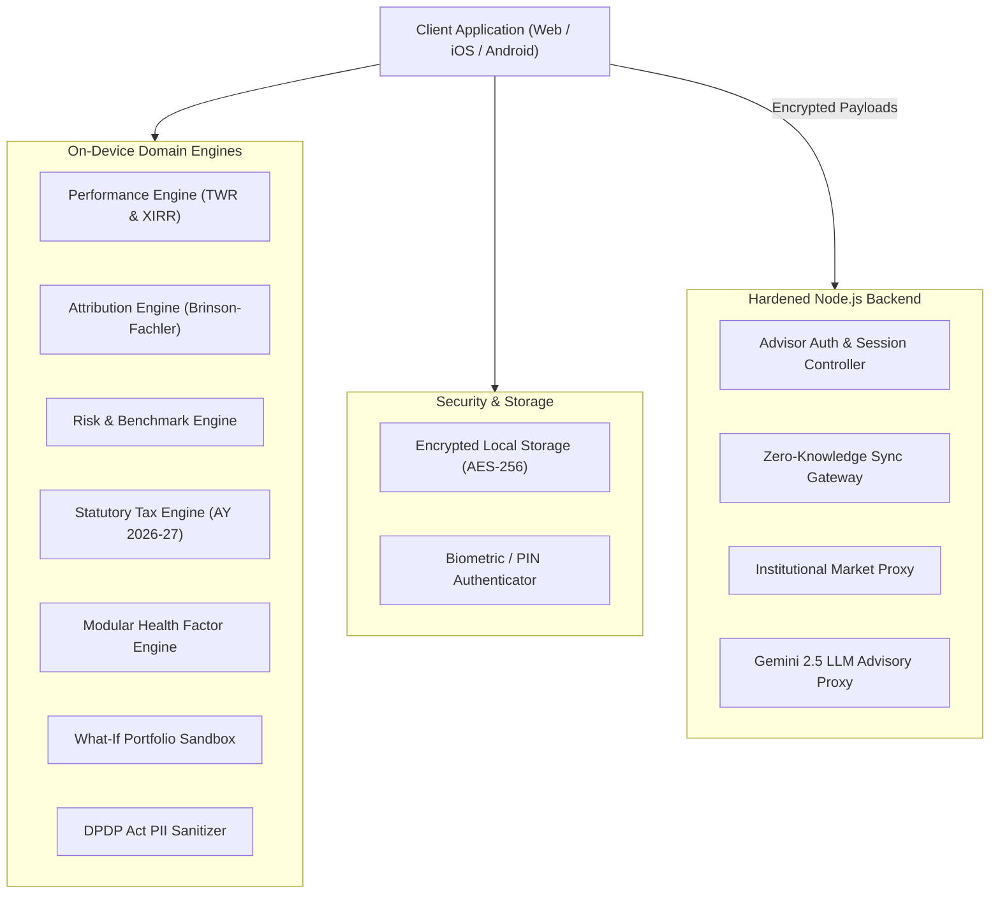

# AssetArray v3.1 System Architecture

## 1. Architectural Overview

AssetArray v3.1 is an institutional-grade wealth management and family office advisory platform built on a hybrid on-device client architecture (React Native / Expo cross-platform) backed by a hardened REST API (Node.js / Express / MongoDB). 

The platform guarantees mathematical defensibility, statutory tax compliance, and cryptographic privacy by executing heavy financial analytics on-device with verified algorithmic engines.



---

## 2. Core Architectural Principles

1. **Client-Side Financial Authority**: All risk calculations, attribution, tax set-off optimizations, and Monte Carlo simulations execute on the client runtime, eliminating server computation lag and ensuring sensitive holdings never traverse unencrypted networks.
2. **Zero-Knowledge Cloud Synchronization**: Client records are symmetrically encrypted on-device via AES-256 using an advisor-controlled passphrase prior to transmission. The backend stores encrypted blobs with zero visibility into raw asset positions.
3. **Data Provenance & Auditability**: Every holding, return, and tax lot tracks its data origin (`LIVE_MARKET`, `HISTORICAL`, `USER_INPUT`, `IMPORTED`, `SIMULATED`, `ESTIMATED`) and data quality state (`HIGH`, `MEDIUM`, `LOW`, `INSUFFICIENT_DATA`).
4. **Mathematical and Statutory Defensibility**: Replaced synthetic approximations with industry-standard equations:
   - True sub-period linked TWR (Dietz / Daily Unit Valuation).
   - Newton-Raphson XIRR solver with bracket fallback.
   - Brinson-Fachler Active Attribution (`Alloc + Select + Interact = ActiveReturn`).
   - Indian Income Tax Act 1961 (amended by Finance Act 2024 / AY 2026-27).
   - Mulberry32 seeded PRNG for reproducible Monte Carlo simulation.

---

## 3. Directory & Module Structure

```
src/
├── components/          # Reusable UI widgets, modals, charts, and layout components
├── hooks/               # Custom hooks for state, responsive breakpoints, network, clients
├── platform/            # Cross-platform abstractions
│   ├── auth/            # Biometrics & PIN authentication
│   ├── billing/         # RevenueCat subscription integration
│   ├── export/          # PDF and CSV export handlers
│   ├── haptics/         # Device vibration feedback
│   └── storage/         # Encrypted persistent store
├── screens/             # Primary top-level navigation screens
│   ├── ClientsScreen.tsx
│   ├── PortfoliosScreen.tsx
│   ├── ToolsScreen.tsx
│   ├── WorkspaceScreen.tsx
│   ├── SettingsScreen.tsx
│   └── PaywallScreen.tsx
├── services/            # Domain analytics engines
│   ├── ai/              # DPDP sanitizer, LLM safety guardrails
│   ├── goals/           # Goal planning, annuity formulas, shortfall models
│   ├── health/          # Modular factor health engine (7 weighted pillars)
│   ├── performance/     # TWR, XIRR, daily returns
│   ├── risk/            # Benchmark analytics, drawdowns, beta, Sharpe, Sortino
│   ├── tax/             # Indian Finance Act 2024 tax engine & Section 70/74 set-off
│   ├── advisorDesk.ts   # Advisor CRM queue, priority ranking, task lifecycle
│   ├── committeeMemo.ts # 14-section institutional investment committee report
│   ├── netWorth.ts      # Multi-asset net worth with anti-double-counting logic
│   ├── pdfReport.ts     # Institutional statement generation
│   ├── scenarioEngine.ts# Stress-testing & what-if rebalancing sandbox
│   └── smartAlerts.ts   # Rule-based threshold alerts with deduplication
├── theme/               # Obsidian & Champagne Gold styling tokens
└── types/               # TypeScript interfaces for all financial domain entities
backend/
├── server.js            # Hardened Express server with validation & rate limiting
└── package.json         # Backend manifest
```

---

## 4. Cross-Platform Parity

AssetArray compiles targeting **Web (SPA)**, **iOS**, and **Android** from a unified codebase using Expo SDK 54 and React 19. Platform-specific branching is managed through standard `.web.ts` and `.native.ts` files in `src/platform/` ensuring 100% feature and visual parity.
