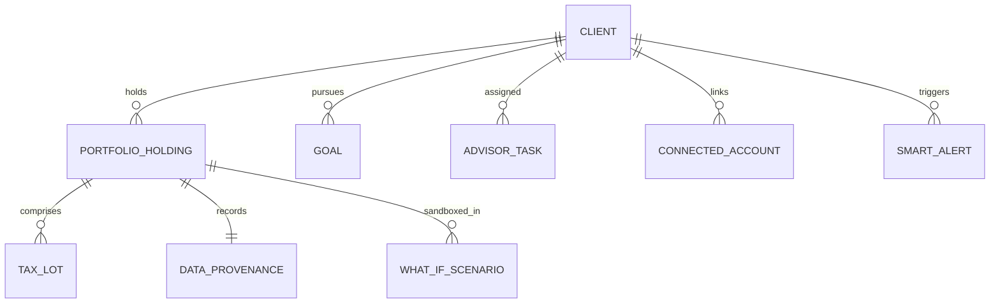

# AssetArray v3.1 Data Model Specification

## 1. Entity-Relationship Overview



---

## 2. Core Entity Definitions (`src/types/wealth.ts`)

### 2.1 Data Provenance & Quality
```typescript
export type DataSource =
  | "LIVE_MARKET"
  | "HISTORICAL"
  | "USER_INPUT"
  | "IMPORTED"
  | "SIMULATED"
  | "ESTIMATED";

export type DataQualityState = "HIGH" | "MEDIUM" | "LOW" | "INSUFFICIENT_DATA";

export interface DataProvenance {
  dataSource: DataSource;
  lastVerifiedAt: string; // ISO 8601
  sourceIdentifier?: string; // e.g., "NSE:HDFCBANK", "CAMS_CAS_IMPORT"
  confidence?: "HIGH" | "MEDIUM" | "LOW";
  warnings?: string[];
}
```

### 2.2 Tax Lot (Date-Driven Statutory Unit)
```typescript
export interface TaxLot {
  id: string;
  purchaseDate: string; // ISO 8601
  units: number;
  costPerUnit: number;
  totalCostBasis: number;
  currentPrice: number;
  currentValue: number;
  unrealizedGain: number;
  holdingPeriodDays: number;
  isLongTerm: boolean;
  statutoryCategory: "EQUITY_STT" | "DEBT_POST_APR23" | "UNLISTED_EQUITY" | "OTHER";
  projectedTaxRate: number; // e.g. 0.20 or 0.125
  estimatedTaxLiability: number;
}
```

### 2.3 Portfolio Holding
```typescript
export interface PortfolioHolding {
  id: string;
  assetName: string;
  assetClass: AssetClass;
  ticker?: string;
  quantity: string | number;
  investedValue: string | number;
  currentValue: string | number;
  targetWeight: string;
  notes?: string;
  purchaseDate?: string;
  provenance?: DataProvenance;
  quality?: DataQualityState;
  taxLots?: TaxLot[];
}
```

### 2.4 Goal Model
```typescript
export interface Goal {
  id: string;
  clientId?: string;
  title: string;
  goalType: "Retirement" | "Education" | "Wealth" | "Emergency";
  targetAmount: number;
  currentAmount: number;
  targetYear: number;
  priority: "Core" | "Growth" | "Optional";
  annualInflationRate?: number; // e.g. 0.06 for 6%
  expectedReturnRate?: number;  // e.g. 0.10 for 10%
  monthlySipRequired?: number;  // Calculated via annuity formula
  projectedFutureCost?: number; // Inflation-adjusted future value
  probabilityOfSuccess?: number;// Derived from Monte Carlo (P5-P95)
  fundingShortfall?: number;
}
```

### 2.5 Smart Alert & Governance
```typescript
export type SmartAlertSeverity = "CRITICAL" | "WARNING" | "NOTICE" | "INFO";
export type SmartAlertStatus = "ACTIVE" | "ACKNOWLEDGED" | "RESOLVED" | "DISMISSED";

export interface SmartAlert {
  id: string;
  clientId: string;
  portfolioId: string;
  title: string;
  message: string;
  severity: SmartAlertSeverity;
  category: "DRIFT" | "CONCENTRATION" | "TAX" | "GOAL" | "RISK";
  createdAt: string;
  status: SmartAlertStatus;
  suggestedAction?: string;
  dismissible: boolean;
}
```

### 2.6 Advisor Task & CRM Desk
```typescript
export type AdvisorTaskPriority = "HIGH_PRIORITY" | "FOLLOW_UP" | "PORTFOLIO_ALERT" | "GOAL_REVIEW";
export type AdvisorTaskStatus = "OPEN" | "IN_PROGRESS" | "DONE";

export interface AdvisorTask {
  id: string;
  clientId: string;
  clientName: string;
  title: string;
  description: string;
  priority: AdvisorTaskPriority;
  status: AdvisorTaskStatus;
  dueDate: string;
  createdAt: string;
  category: "PORTFOLIO" | "TAX" | "GOAL" | "CRM";
}
```
