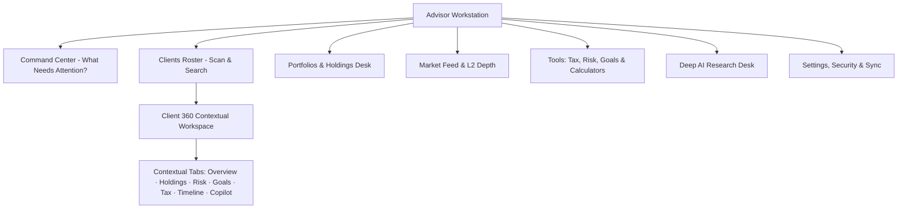

# AssetArray Information Architecture & Navigation Transformation

**Status:** Canonical Release Architecture  
**Release Family:** 3.3.x  

---

## 1. Information Architecture Philosophy

AssetArray previously exposed numerous technical engines as disconnected top-level destinations, forcing advisors to switch screens frequently. 

The transformed architecture adopts **Contextual Hierarchy**:
$$\text{Advisor Global Workstation} \longrightarrow \text{Persistent Client Context} \longrightarrow \text{Actionable Diagnostic Workspaces}$$



---

## 2. Global Workstation Destinations

| Destination | Purpose | Primary Action | Key Metrics Exposed |
|:---|:---|:---|:---|
| **Command Center** | Fiduciary start-of-day cockpit | Review critical alerts & triage | Critical Today, Opportunities, Upcoming Tasks |
| **Clients** | High-density roster scanning & search | Select client dossier / Add client | Name, AUM, Risk Tier, Health Score, Alerts, Last Review |
| **Portfolios** | Aggregate book & holdings workstation | Rebalance / Audit drift | Total AUM, Day P&L, Asset Allocation, Securities Table |
| **Markets** | Official AMFI NAVs & L2 depth | Inquire symbol / Monitor ticker | Real AMFI NAVs, Micro-Ticker, 5-Tier Order Book |
| **Tools Suite** | Specialized financial engines | Run simulation / Model tax | Tax Harvesting Studio, Monte Carlo, Scenario Sandbox, SIP |
| **AI Research** | Institutional source-ranked intelligence | Search regulatory & market topics | SEBI/RBI circulars, Company filings, Citation mapping |
| **Settings** | Configuration, E2EE sync & billing | Manage keys / Export backup | Cloud Sync status, Active Currency, Theme, Subscription |

---

## 3. Persistent Client Context

When an advisor selects a client (e.g. `Rahul Mehta`), the platform anchors a **Context Bar** at the top of sub-views:
```text
[CLIENT CONTEXT] Rahul Mehta · Growth Portfolio | AUM: ₹4.82 Cr | Health: 78/100 | Risk: Moderate | As of: 05 Sep 2026 · 15:42 IST
```
The advisor never has to wonder: *"Whose portfolio am I inspecting?"*

---

## 4. Contextual Navigation Inside Client 360

Advisors can toggle between client facets without returning to the root sidebar:
1. **Overview:** 5-Pillar Health diagnostic, KPI cards, and Next Best Action.
2. **Holdings:** Granular asset table with quantity, CMP, value, drift, and rebalancing triggers.
3. **Risk:** Sharpe ratio, Beta, Volatility, Max Drawdown, and Monte Carlo probability.
4. **Tax:** Statutory LTCG/STCG liability, Section 70/74 loss carry-forwards, and harvestable lots.
5. **Goals:** Education, retirement, and custom milestone progress bars.
6. **Insights & Timeline:** Historical state deltas, fiduciary decision journal, and meeting logs.
7. **AI Copilot Drawer:** In-context analysis using client-scoped parameters.

---

## 5. Mobile Navigation Adaptations

- **Bottom Navigation Bar:** Retains 5 primary touch points (`Home`, `Clients`, `Portfolio`, `Markets`, `More`).
- **"More" Bottom Sheet:** Houses Tools, AI Research, Settings, and Document Vault.
- Contextual tabs inside Client 360 become a horizontal pill scroll with instant touch response.
