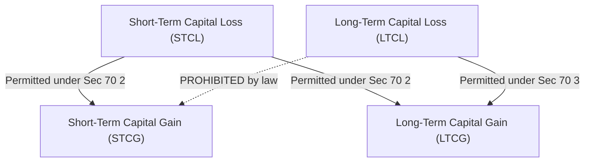

# AssetArray v3.2 Statutory Tax Methodology (Finance Act 2024 / AY 2026-27)

## 1. Statutory Framework Overview

AssetArray v3.2 incorporates the revised Indian capital gains tax regime enacted under the **Finance (No. 2) Act, 2024** applicable for **Assessment Year 2026-27 (Financial Year 2024-25 / 2025-26)**.

All calculations strictly avoid synthetic heuristics (e.g. array index assumptions or uncalibrated percentage estimates) and enforce date-driven statutory holding periods and marginal tax rates with health and education cess.

---

## 2. Holding Period Classifications

Under the amended Section 2(42A) of the Income-tax Act, 1961:

| Asset Class | Holding Period for LTCG | Statutory Section |
|---|---|---|
| **Listed Equity Shares & Equity Mutual Funds** (STT paid) | $> 12 \text{ months}$ (365 days) | Sec 112A |
| **Listed Debt Securities, Bonds & Debentures** | $> 12 \text{ months}$ (365 days) | Sec 112 |
| **Unlisted Equity Shares & Real Estate** | $> 24 \text{ months}$ (730 days) | Sec 112 |
| **Specified Mutual Funds** ($>65\%$ debt acquired after 01-Apr-2023) | **Always Short Term** (Regardless of duration) | Sec 50AA |
| **Unlisted Debt & Others** | $> 24 \text{ months}$ | Sec 112 |

---

## 3. Statutory Tax Rates (with 4% Health & Education Cess)

| Category | Section | Base Rate | Effective Rate (incl. 4% cess) | Exemption Threshold |
|---|---|---|---|---|
| **STCG on Listed Equity** | 111A | 20.00% | **20.80%** | Nil |
| **LTCG on Listed Equity** | 112A | 12.50% | **13.00%** | **₹1,25,000** per FY |
| **LTCG on Other Assets** | 112 | 12.50% | **13.00%** | Nil |
| **STCG on Other Assets** | Slab Rate | Up to 30.00% | **31.20%** | Normal slab exemption |
| **Specified Mutual Funds** | 50AA | Slab Rate | **31.20%** | Normal slab exemption |

> **Finance Act 2024 Update**: The LTCG exemption threshold under Section 112A has been increased from ₹1,00,000 to **₹1,25,000** per financial year. STCG rate under Section 111A was revised to 20% (previously 15%).

---

## 4. Section 70 & Section 74 Intra-Head Set-Off Hierarchy

AssetArray enforces the strict legal hierarchy mandated under the Income Tax Act:

1. **Short-Term Capital Losses (STCL)** can be set off against:
   - First: Current-year Short-Term Capital Gains (STCG).
   - Second: Current-year Long-Term Capital Gains (LTCG).
2. **Long-Term Capital Losses (LTCL)** can **ONLY** be set off against:
   - Current-year Long-Term Capital Gains (LTCG).
   - **STRICT PROHIBITION**: LTCL cannot offset STCG under any circumstance.
3. **Carry Forward**: Unabsorbed losses may be carried forward for up to 8 assessment years, provided the return is filed before the due date under Section 139(1).

---

## 5. Tax-Loss Harvesting Algorithm & Anti-Avoidance (GAAR)

### 5.1 Optimization Objective
The engine scans unrealized loss-making lots to maximize immediate tax savings while preserving the client's asset allocation:

$$\text{Tax Shield} = (\text{Harvestable STCL} \times \tau_{\text{ST}}) + (\max(0, \text{Harvestable LTCL} - \text{Remaining Exemption}) \times \tau_{\text{LT}})$$

### 5.2 Indian General Anti-Avoidance Rule (GAAR) Advisory
India does not possess a codified 30-day "Wash Sale Rule" like US IRC §1091. However, Chapter X-A (General Anti-Avoidance Rules / GAAR) empowers assessing officers to re-characterize transactions lacking commercial substance. AssetArray generates fiduciary warnings recommending:
- Reinvesting sale proceeds into an economically equivalent ETF/index proxy rather than executing identical same-day buybacks.
- Observing a minimum statutory settlement buffer (T+1 / 3 trading days) before re-entering identical securities.

---

## 6. Zero-Synthetic Tax Lot Integrity (V3.2 Invariant)

To guarantee institutional auditability:
1. **Mandatory Date Verification**: Every tax lot evaluated in institutional mode requires an explicit `acquiredAt` timestamp.
2. **Tax Verification States**:
   - `DATE_VERIFIED`: Exact acquisition date verified against depository/CAMS statement.
   - `DATE_MISSING`: No date present; `isLongTerm = null`, `quality = INSUFFICIENT_DATA`. Potential tax shield is zero.
   - `DATE_INVALID`: Malformed timestamp; requires advisor remediation before trade calculation.
   - `LEGACY_ESTIMATE`: Inferred from unstructured notes (e.g. legacy imports). Clearly labeled as low confidence and excluded from high-confidence statutory exports.
3. **Audit Methodology ID**: `in-tax-finance-act-2024-v2.0` (Statutory compliance verification date: September 2026).
