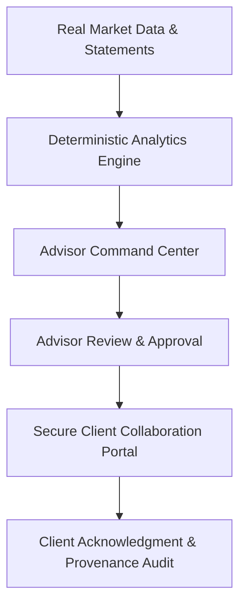

# AssetArray V3.4 Strategic Roadmap: Real-Data & Client Collaboration

**Status:** PLANNED (Future Engineering Milestone)  
**Baseline Release:** V3.3.1  
**Scope Notice:** This document outlines prospective capabilities under technical evaluation. Features described herein are planned milestones and do not represent immediate infrastructure commitments or production guarantees until formally released.

---

## Strategic Objective

While AssetArray V3.2 established institutional-grade deterministic engines and V3.3 established the Advisor Command Center, V3.4 is strategically focused on connecting those engines to **traceable market data feeds** and extending workflow directly into **advisor-governed client collaboration**.

---

## Priority 1: Real Data Integration (PLANNED)

*Rationale:* Deterministic quantitative engines are only as sound as the provenance and accuracy of their inputs. Traceable data feeds ground calculations in verifiable history.

* **Verified Market Feeds:** Integration with standardized end-of-day and streaming feeds (NSE, BSE, global indices).
* **Historical Price Series:** Automated fetching of adjusted close price series for accurate multi-year volatility, Sharpe ratios, and drawdowns.
* **Portfolio Transactions & Tax Lots:** Granular tracking of buy/sell events, dividends, corporate actions, and acquisition cost lots.
* **Consolidated Statement Ingestion:** Semi-automated parsing of CAS (Consolidated Account Statement), CAMS, and depository holding statements.
* **Benchmark History:** Official total return index (TRI) feeds for accurate benchmark comparison and Brinson-Fachler attribution.

---

## Priority 2: Client Collaboration (PLANNED)

*Rationale:* Establishing an advisor-mediated communication channel to review strategy and document alignment without bypassing advisor governance.

* **Advisor-Governed Review Flow:**  
  `Advisor Formulation` → `Internal Review` → `Advisor Approval` → `Client Sharing` → `Client Acknowledgment`
* **Secure Client Portal:** Read-only web portal for end-clients displaying advisor-approved valuations, allocation breakdowns, and goal tracking.
* **Document Sharing & Versioning:** Secure distribution of executive PDF statements and periodic quarterly review packs.
* **Structured Acknowledgment Logs:** Capturing client review timestamps, feedback, and notes within the Advisor Decision Journal (without claiming statutory e-signature authority unless verified).
* **Direct Messaging & Contextual Comments:** Secure thread discussions linked directly to specific holdings or suggested portfolio rebalancing proposals.

---

## Priority 3: Audit & Data Operations (PLANNED)

*Rationale:* Equipping wealth practices and compliance officers with exportable, reproducible calculation evidence and data provenance schedules.

* **Advisor Audit Export Package:** Complete ZIP bundle containing calculation snapshots, holding schedules, decision logs, and timestamped engine inputs.
* **Data Provenance Schedule:** Per-holding telemetry identifying whether values originated from API feeds, custodian files, or manual advisor input.
* **Calculation Methodology Snapshots:** Machine-readable records of mathematical constants, tax rules, and benchmark weights applied to historical statements.
* **Tax-Lot Data Quality Report:** Diagnostic checks highlighting missing acquisition dates, ambiguous holding periods, or unverified cost bases.
* **Client Activity Audit Trail:** Immutable log of statements generated, proposals reviewed, and client acknowledgments recorded.
